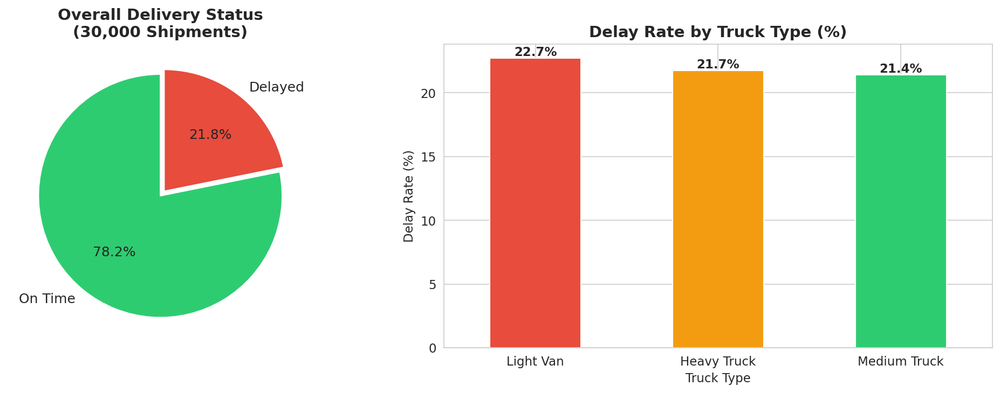
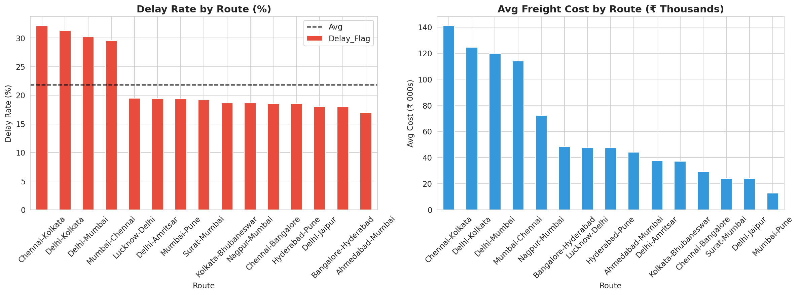
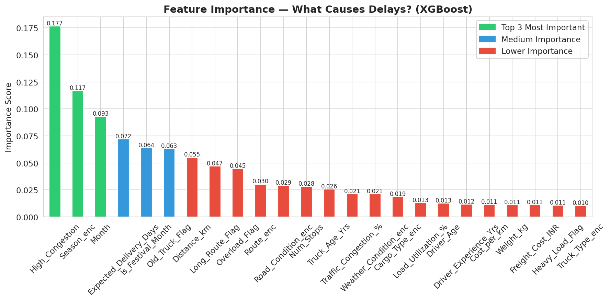

# 🚛 Smart Logistics Analytics System

A data-driven web application for analyzing and predicting delivery delays in India's heavy freight logistics network.

🔗 **Live App:** [smartlogisticsanalytics.streamlit.app](https://smartlogisticsanalytics.streamlit.app)

---

## 📌 Project Overview

Smart Logistics Analytics System is a machine learning powered dashboard built to help logistics managers monitor shipment performance, predict delivery delays, and identify the most efficient routes across India's major freight corridors.

The system analyzes **30,000 synthetic shipments** across **15 major Indian routes** spanning 2020–2024, providing actionable insights through an interactive web interface.

---

## 🎯 Key Features

- **📊 Performance Dashboard** — Real-time KPIs including total shipments, delay rate, average freight cost, and distance metrics with monthly and route-level breakdowns
- **🔮 Delay Predictor** — ML-powered prediction engine that estimates delivery delay probability based on route, truck type, weather, road conditions, and driver profile
- **🗺️ Route Recommender** — Month-wise best route suggestions ranked by efficiency score combining delay rate, cost, and delivery speed
- **💡 Business Insights** — Key findings on delay causes, seasonal patterns, and model performance

---

## 🛠️ Tech Stack

| Layer | Tools |
|---|---|
| Frontend | Streamlit |
| Data Processing | Python, Pandas, NumPy |
| Machine Learning | XGBoost, Scikit-learn, SMOTE |
| Data Storage | CSV (synthetic dataset) |
| Deployment | Streamlit Cloud, GitHub |
| Development | Google Colab, VS Code |

---

## 📁 Project Structure

```
smart-logistics-analytics/
│
├── app.py                          # Main Streamlit application
├── requirements.txt                # Python dependencies
│
├── Models/
│   ├── xgboost_model.pkl           # Trained XGBoost classifier
│   ├── model_config.json           # Model metadata and thresholds
│   ├── le_route.pkl                # Label encoder — Route
│   ├── le_truck_type.pkl           # Label encoder — Truck Type
│   ├── le_weather_condition.pkl    # Label encoder — Weather
│   ├── le_road_condition.pkl       # Label encoder — Road Condition
│   ├── le_cargo_type.pkl           # Label encoder — Cargo Type
│   ├── le_exp_category.pkl         # Label encoder — Driver Experience
│   └── le_season.pkl               # Label encoder — Season
│
├── data/
│   ├── india_logistics_v2_processed.csv   # Main dataset (30,000 rows)
│   ├── best_routes.csv                    # Monthly best route lookup
│   └── route_metrics_final.csv            # Route efficiency rankings
│
└── images/                         # EDA and analysis charts
```

---

## 📊 Dataset

- **Size:** 30,000 shipment records
- **Period:** 2020 – 2024
- **Routes:** 15 major Indian freight corridors (Delhi-Mumbai, Mumbai-Chennai, Bangalore-Hyderabad, and more)
- **Features:** 46 columns including distance, weight, freight cost, truck type, weather, road condition, driver profile, and engineered features

**Target Variable:** `Delay_Flag` — whether a shipment was delivered late (1) or on time (0)

---

## 🤖 ML Model

| Metric | Value |
|---|---|
| Algorithm | XGBoost Classifier |
| Recall | 85.6% |
| Training Samples | 37,518 (after SMOTE) |
| Features Used | 24 |
| Decision Threshold | 0.35 |

**Key delay factors identified:**
1. Traffic Congestion
2. Storm Weather Conditions
3. Overloaded Trucks (Load > 90%)
4. Old Trucks (Age > 8 years)
5. Festival Months (Oct/Nov/Jan)
6. Poor Road Conditions
7. Long Distance Routes (> 800 km)
8. Inexperienced Drivers (< 3 years)

---

## 🚀 Run Locally

```bash
git clone https://github.com/YOUR_USERNAME/smart-logistics-analytics.git
cd smart-logistics-analytics
pip install -r requirements.txt
streamlit run app.py
```

---

## 👥 Team — Group 82

| Name | Role |
|---|---|
| Mohammad Kaif | Data Analysis, ML Model, Dashboard |
| Harshita Hoiyani | Data Processing, EDA, Insights |
| Ansh Mittal | Route Analysis, Visualization |

**Course:** UCF 439 — Capstone Project | JAN–MAY 2026
**Institution:** DIT University, Dehradun

---

## 📸 Screenshots

### Dashboard


### Route Analysis


### Feature Importance

